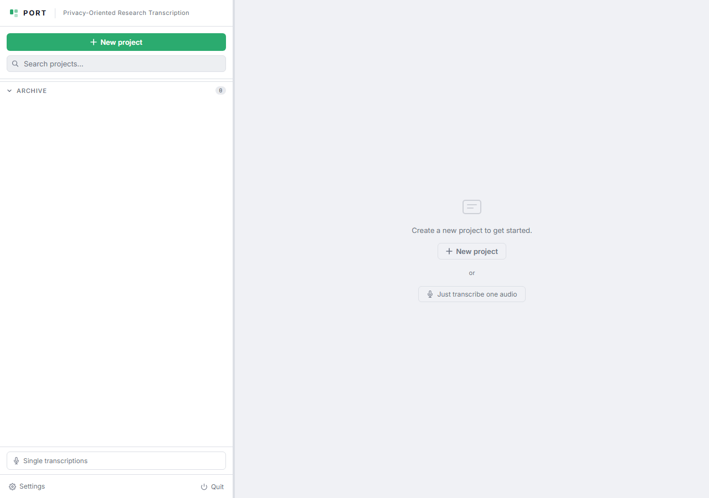

# PINE — Private Interview & Notes Environment

[](LICENSE)
[](https://www.python.org/)
[](#setup)

A **fully local** interview transcription tool for UX researchers. No recordings or conversation data leave your PC. All processing runs offline after model download.



---

## Overview

PINE provides:

- **Local transcription** — WhisperX + faster-whisper or Parakeet TDT (STT) + pyannote (speaker diarization); mlx-whisper on Apple Silicon
- **Per-speaker tracks** — Zoom meeting folders and multi-channel files are transcribed track by track, so overlapping speech survives and diarization is skipped entirely. Speaker names come from the filenames
- **Project management** — Organize recordings by research project
- **Tagging & comments** — Highlight spans, apply tags, add researcher notes
- **Attachments** — Upload any files to a project (PDFs, presentations, client feedback) with editable names and one-click download
- **Export** — Markdown (LLM-ready) or ODT (LibreOffice/Google Docs)

**Supported formats:** MP3, MP4, M4A, WAV, MKV, WebM, OGG, FLAC

---

## Setup

### Prerequisites

- **Python 3.11, 3.12, or 3.13**
- **FFmpeg** (bundled via `static-ffmpeg`)
- **HuggingFace account** — required for pyannote (accept license) and model downloads
- **NVIDIA GPU** (optional) — CUDA recommended; falls back to CPU if unavailable

> **Disk space:** models are several GB. Make sure you have room before starting onboarding.

### Windows

Double-click **`WIN_Install.bat`** in the repository root (or run it from Explorer). On first run it creates `.venv`, installs dependencies from `backend/requirements.txt`, starts the server, and opens the browser.

Alternatively, from a terminal with the venv activated:

```powershell
.\.venv\Scripts\activate
python backend\run.py
```

### macOS / Linux

Double-click **`MAC_Install.command`** in Finder, or from Terminal:

```bash
chmod +x MAC_Install.command
./MAC_Install.command
```

Creates the venv and installs dependencies on first run, then starts the server and opens the browser at `http://pine.localhost:5000/launch` (or `http://127.0.0.1:5000`).

> **Note:** `WIN_Install.bat` and `MAC_Install.command` stay in the repo root. They handle both first-time setup and subsequent launches.

### First launch

1. **System check** — Verifies Python, FFmpeg, and hardware
2. **Modules** — Transcription + diarization (required); optionally PII removal. This step also picks the transcription model
3. **Storage** — Choose paths for models and projects
4. **HuggingFace** — Token required for pyannote diarization model
5. **Download** — Models download from HuggingFace
6. **Ready** — Create projects and upload recordings

**Transcription models** — two choices, switchable later in Settings; the second one downloads on demand:

| Model | Runs on | Size | Language |
|---|---|---|---|
| Whisper large-v3 (default) | GPU (Neural Engine on Mac) | ~3 GB | can be set by hand |
| Parakeet TDT 0.6B v3 | CPU, leaving the card to speaker detection | ~0.7 GB | detected automatically |

> **macOS:** Whisper runs through mlx-whisper (Apple Silicon optimised); Parakeet runs on the CPU as it does everywhere else.

---

## Usage

| Screen | Purpose |
|--------|---------|
| **Projects** | Create projects, upload recordings, export all |
| **Recording** | Video/audio player, transcript, tags, comments |
| **Tags** | View tagged quotes grouped by tag (affinity mapping) |
| **Settings** | Font size, theme, export defaults, model management |

**Workflow:** Create project → Upload recording → Wait for transcription → Open recording → Tag spans → Export or transfer.

---

## Privacy

Recordings and transcripts stay on your machine. The app still opens outbound connections in these situations:

| Situation | Typical endpoints | Notes |
|-----------|-------------------|--------|
| **Onboarding / model download** | Hugging Face Hub, PyPI, PyTorch wheel indexes (`download.pytorch.org`) | Installs ML packages and pulls Whisper, pyannote, optional PII models. |
| **Checking the Hugging Face token** | Hugging Face API | Validates the token when you save it during setup. |
| **Check for updates** (Settings) | `api.github.com` | Only when you use the in-app update check. |
| **Optional PII model install** | Hugging Face | If you install the GLiNER model from Settings. |
| **WhisperX word alignment** (Windows / Linux) | Hugging Face Hub | After onboarding, transcription normally runs with Hub offline. For each **new** detected language, WhisperX may need to download a **language-specific wav2vec2** align model once; the app briefly allows Hub only during that download, then returns to offline mode. Cached languages do not hit the network. |
| **Always allow Hub** | — | Set environment variable `PINE_ALLOW_HF_NETWORK=1` to skip Hub offline mode for transcription (not required for normal use). |

Apple Silicon uses MLX for STT and does not use the WhisperX align path above.

**Threat model:** PINE is a single-user local application bound to `127.0.0.1:5000`. CORS is restricted to `127.0.0.1` and `pine.localhost` on the app's own port, but there is no authentication — treat it like any other local dev server and do not expose the port to a network you do not control. See [TODO.md](documentation/TODO.md) for tracked hardening items.

---

## Development

```bash
# Run the test suite (34 modules, 558 tests)
cd backend && pytest

# With coverage
cd backend && pytest --cov=app
```

Tests use an in-memory SQLite DB and temp directories — they never touch real data.

### Technical notes

- **Data location:** `backend/data/` (SQLite DB), `projects/` (per-project folders)
- **Models:** stored in `models/` (configurable in onboarding)
- **Port:** `127.0.0.1:5000` (local only)

`models/`, `projects/`, `backend/data/` and `backend/logs/` are gitignored — they hold user recordings and multi-GB downloads, never source.

### Documentation

| Doc | Contents |
|-----|----------|
| [ARCHITECTURE.md](documentation/ARCHITECTURE.md) | System design, data model, transcription pipeline |
| [API.md](documentation/API.md) | Full endpoint reference and data shapes |
| [DESIGN.md](documentation/DESIGN.md) | UI design system and tokens |
| [TODO.md](documentation/TODO.md) | Roadmap and known gaps |
| [AGENTS.md](documentation/AGENTS.md) | Guidance for AI coding agents |

---

## License

[MIT](LICENSE)
