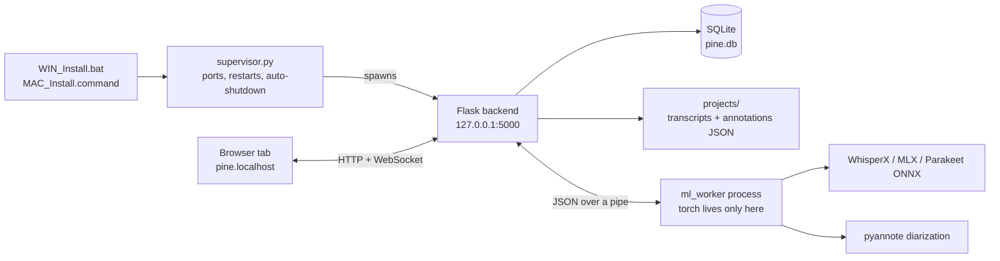

<div align="center">


# PINE

**Private Interview & Notes Environment**

Interview transcription and analysis for UX researchers — running entirely on your own machine.

[](https://github.com/paul815/pine/actions/workflows/tests.yml)
[](LICENSE)
[](https://www.python.org/)
[](#requirements)
[](https://github.com/paul815/pine/releases)

[Install](#install) · [Requirements](#requirements) · [Speed](#models-and-speed) · [Privacy](#privacy-and-network) · [Docs](#documentation)

</div>

<!-- SCREENSHOTS — the images in backend/tools/screenshots/ are from an older build
     that still carried the previous product name, so nothing is shown here yet.
     Capture four fresh shots at 1280x800, save them to documentation/screenshots/,
     and uncomment the block below:
       1. projects-light.png  — a project with 3-4 recordings, brief filled in
       2. recording-dark.png  — transcript with coloured codes and a comment open
       3. codes-light.png     — the Codes screen with themes and quotes
       4. settings-dark.png   — Backup & Restore section

<p align="center">
  
  
</p>
-->

Upload an interview, get a speaker-separated transcript, code it, and export something an LLM or a colleague can read. Nothing is uploaded anywhere: the models run on your hardware, and after setup the app works with the network off.

---

## Why PINE

- **Confidential material stays confidential.** No cloud transcription service, no account, no per-minute billing. The kind of research that cannot legally leave the building — NDA interviews, medical, HR, internal strategy — can be transcribed at all.
- **Built around research, not around audio files.** Projects carry an objective, research questions, hypotheses, an interview guide and participant segments. Highlights become *codes*, codes group into *themes*.
- **Real speaker separation, and a shortcut when you have it.** pyannote diarizes single-file recordings; Zoom per-participant folders and multi-channel files skip diarization entirely, so overlapping speech survives and speaker names come from the filenames.
- **Exports built for the next step.** Markdown with your codes and comments inline, optionally prefixed with your own LLM prompt, or ODT where codes and comments become real ODF annotations.
- **Telemetry is switched off at the source.** `backend/run.py` disables HuggingFace, pyannote, OpenTelemetry and W&B reporting before the app is even imported.

---

## Features

**Transcription**

- Whisper large-v3 (GPU / Apple Neural Engine) or Parakeet TDT 0.6B v3 (CPU, 25 languages, auto-detected) — switchable in Settings
- pyannote speaker diarization, running in parallel with transcription rather than after it
- Per-speaker tracks for Zoom meeting folders and multi-channel files — no diarization needed
- Chunking for long files, crash recovery for interrupted jobs, live progress over WebSocket with a learned ETA
- Formats: MP3, MP4, M4A, WAV, MKV, WebM, OGG, FLAC

**Analysis**

- Project brief: objective, research questions, hypotheses, stakeholders, methodology, interview guide — reorderable, edited in place
- Participant segments with screener questions; assign recordings to a segment and filter by it
- Codes on any span of text, with colours, plus researcher comments
- Themes: group codes and review every quote per theme on the Codes screen (affinity mapping)
- Edit the transcript, rename speakers, import codes from another project
- Attachments: any project file (PDFs, decks, client feedback) with editable names

**Output**

- Export one recording or a whole project as Markdown or ODT
- Toggle comments, codes, project details, participant details
- Two saved LLM prompts (project-level and single-recording) prepended to the export
- Optional PII removal before export — GLiNER multilingual, with a sensitivity slider
- Transfer package: a ZIP of transcripts, annotations and metadata without the media

**Housekeeping**

- Automatic backups on startup and on a schedule, with retention and optional media inclusion; restore takes a safety snapshot first
- Link mode: keep recordings where they are on disk instead of copying them into the project
- Single transcriptions: drop in one file without creating a project

---

## Requirements

| | Minimum | Notes |
|---|---|---|
| **OS** | Windows 10/11, macOS | Metal acceleration needs macOS 12.3+; older versions run in CPU mode. Linux runs but is not packaged — see below |
| **Python** | 3.11, 3.12 or 3.13 | The installers find it themselves |
| **Disk** | 12 GB free | Checked during setup. Models ~3.1 GB, ML packages take the rest |
| **RAM** | 10 GB recommended | Setup warns below that |
| **GPU** | Optional | NVIDIA + CUDA is the fast path; 4 GB VRAM or less gets a warning. Apple Silicon uses MLX. No GPU means CPU fallback |
| **HuggingFace account** | Required | Free. Needed to accept the pyannote licence and download models |

Extra downloads on demand: Parakeet +0.7 GB, PII model +1.8 GB.

**Platform support**

| Configuration | Status |
|---|---|
| Windows + NVIDIA GPU | Supported — primary target |
| Windows, no GPU | Supported — CPU fallback, roughly 10x slower |
| macOS, Apple Silicon | Supported — Whisper via MLX on the Neural Engine |
| macOS, Intel | Works, CPU only |
| Windows + AMD GPU | Falls back to CPU (ROCm not wired up) |
| Linux | Experimental — `MAC_Install.command` sets it up, but it opens the browser with the macOS `open` command; start the app by hand |

---

## Install

**1. Get the files.** Download the latest [release ZIP](https://github.com/paul815/pine/releases) and unpack it somewhere permanent — the app lives where you unpack it, so not a temp folder. Or clone it:

```bash
git clone https://github.com/paul815/pine.git
```

**2. Run the launcher for your OS.** The same file does first-time setup and every later launch: it creates `.venv`, installs base dependencies, starts the app and opens the browser.

- **Windows** — double-click **`WIN_Install.bat`**
- **macOS** — double-click **`MAC_Install.command`** (first time: right-click → Open, to get past Gatekeeper)

```bash
chmod +x MAC_Install.command
./MAC_Install.command
```

The app opens at `http://pine.localhost:5000/launch`. Closing the last PINE tab shuts the whole thing down.

<a id="unsigned-launcher"></a>

> **Windows will flag the launcher.** `WIN_Install.bat` is an unsigned script, and Windows marks
> everything unpacked from a downloaded ZIP as coming from the internet — so you get a "publisher
> could not be verified" prompt, or on machines with Smart App Control a hard block. This is what
> Windows does with every unsigned script; it says nothing about what is in this one.
>
> Two ways past it, best first:
>
> - **Clone instead of downloading.** Files created by git carry no such mark, so nothing is flagged.
> - **Unblock after unpacking** — right-click `WIN_Install.bat` → Properties → tick **Unblock**. The
>   mark sits on every unpacked file, so it is easier to clear the whole folder from PowerShell:
>
>   ```powershell
>   Get-ChildItem -Path . -Recurse | Unblock-File
>   ```
>
> Do **not** switch Smart App Control off to get past this — on Windows 11 it cannot be switched back
> on without resetting the OS. The launcher is plain batch and does exactly what step 2 describes;
> read it first if you would rather check than trust.

**3. Walk through setup** — five steps, once:

| Step | What happens |
|---|---|
| System check | Python, disk, memory, GPU |
| Modules | Pick the transcription model; optionally add PII removal |
| Storage | Where models and projects live |
| HuggingFace | Paste a token — needed for the pyannote diarization model |
| Download | Models and ML packages, several GB, one time |

> **HuggingFace token:** create one at [huggingface.co/settings/tokens](https://huggingface.co/settings/tokens) (read access is enough) and accept the conditions on [pyannote/speaker-diarization-community-1](https://huggingface.co/pyannote/speaker-diarization-community-1). Without the accepted licence the download fails with a 401.

---

## Models and speed

Two transcription models, switchable in Settings at any time; the second one downloads on demand.

| Model | Runs on | Download | VRAM | Language |
|---|---|---|---|---|
| **Whisper large-v3** (default) | GPU — Neural Engine on Apple Silicon | ~3 GB | 6.5 GB | Set it yourself, or auto-detect |
| **Parakeet TDT 0.6B v3** | CPU, leaving the GPU to speaker detection | ~0.7 GB | — | 25 languages, auto-detected only |

Measured on an RTX 4070 SUPER against real interview recordings — one hour of audio:

| Configuration | Time for 1 hour |
|---|---|
| Parakeet ONNX, CUDA | ~2 min |
| Parakeet ONNX, CPU int8 | ~6 min |
| Whisper turbo, CPU int8 | ~17 min |
| Whisper large-v3, CPU int8 | ~1 h 48 min |

Parakeet runs on the CPU on purpose: its CPU/GPU penalty is 2.8x where Whisper's is 17–23x, so it can hand the graphics card to diarization and both stages run at once. On Russian audio it was also the more accurate of the two. Full numbers and method: [documentation/stt-benchmark/](documentation/stt-benchmark/README.md) *(in Russian)*.

---

## Using PINE

| Screen | What it is for |
|---|---|
| **Projects** | Project brief, participant segments, recordings, upload, export |
| **Recording** | Player, transcript, codes, comments, speaker names |
| **Codes** | Every quote grouped by code and theme — affinity mapping |
| **Settings** | Display, export defaults, model switching, PII, backups, shortcuts, reset |

Typical flow: create a project → fill in the brief → upload recordings → wait for transcription → open a recording → code the interesting spans → review on the Codes screen → export.

---

## Your data

| What | Where |
|---|---|
| Database | `backend/data/pine.db` |
| Projects | `projects/<project>/` — media, `*_transcript.json`, `*_annotations.json`, `project_tags.json`, `attachments/` |
| Models | `models/` |
| Backups | `backups/` |
| Logs | `backend/logs/` |

Paths for models, projects and backups are chosen during setup and changeable in Settings. Annotations are plain JSON next to the transcript on purpose — a project folder is readable without PINE.

- **Backups** — Settings → Backup & Restore. Automatic on startup and daily, weekly or monthly (weekly by default), keeping the last 3, 5, 10 or all. Media files are excluded unless you ask for them. Restoring writes a safety snapshot first and never overwrites your token or paths.
- **Handing a project to a colleague** — the Transfer button packages transcripts, annotations and metadata as a ZIP, without the audio.
- **Starting over** — Settings → Danger zone, or `backend/reset_win.bat` / `backend/reset.command`. To uninstall, delete the folder: nothing is written outside it except the shortcuts you asked for.

---

## Privacy and network

Recordings and transcripts never leave your machine. The app does open outbound connections in these situations:

| Situation | Endpoints | Notes |
|---|---|---|
| Setup / model download | HuggingFace Hub, PyPI, `download.pytorch.org` | Installs ML packages and downloads models |
| Checking the HF token | HuggingFace API | Validates the token when you save it |
| Check for updates | `api.github.com` | Only when you press the button in Settings |
| Optional PII model | HuggingFace | Only if you install GLiNER |
| WhisperX word alignment (Windows/Linux) | HuggingFace Hub | Transcription normally runs with the Hub offline. For each **new** language WhisperX downloads a wav2vec2 alignment model once; the app allows the Hub only for that download, then goes offline again. Apple Silicon uses MLX and never takes this path |

Set `PINE_ALLOW_HF_NETWORK=1` to skip Hub offline mode entirely. Not needed for normal use.

**Threat model.** PINE is a single-user local application. The backend binds to `127.0.0.1` (port 5000 by default, or the next free one) and CORS is limited to `127.0.0.1` and `pine.localhost` on that port — but the backend has **no authentication**, so treat it like any other local dev server and do not expose the port to a network you do not control. The supervisor's control API on port 5001 does require a per-run token. Known gaps are tracked in [TODO.md](documentation/TODO.md); to report a vulnerability see [SECURITY.md](SECURITY.md).

---

## Troubleshooting

| Symptom | Fix |
|---|---|
| `401` or `403` while downloading models | The token lacks read access, or the pyannote licence has not been accepted. Accept it on the model page, then retry |
| Setup finds no Python | Install 3.11–3.13 from python.org with "Add to PATH" ticked, then run the launcher again |
| GPU ignored, everything is slow | System check reports what it found. A missing CUDA toolkit is the usual cause; without an NVIDIA card, CPU mode is expected — switch to Parakeet |
| Port 5000 busy | The supervisor picks the next free port automatically; open the URL printed in the console |
| Browser never opens | Go to `http://127.0.0.1:5000/` by hand. On Linux this is expected — the launcher uses the macOS `open` command |
| Transcription stuck | A watchdog kills a hung worker and the recording returns to the queue. Details in `backend/logs/` |
| Install broken beyond repair | `backend/reset_win.bat` or `backend/reset.command`, then run the launcher again |
| "Smart App Control blocked a file that may be unsafe", or "publisher could not be verified" | Windows blocks unsigned scripts unpacked from a downloaded ZIP — see [the note on the unsigned launcher](#unsigned-launcher). Cloning instead of downloading avoids it entirely |

Filing an issue? Attach the relevant file from `backend/logs/` and the System check output.

---

## Development

```bash
git clone https://github.com/paul815/pine.git
cd pine
python -m venv .venv
source .venv/bin/activate
pip install -r backend/requirements.txt
pip install pytest pytest-cov ruff pre-commit
```

On Windows the activation line is `.\.venv\Scripts\activate`. Dev tooling is deliberately absent from `requirements.txt` — a user's install carries no test runner or linter.

```bash
cd backend && python supervisor.py
```

That is the full stack, the way the launchers start it. `python run.py` starts the backend alone, without the supervisor.

```bash
cd backend && pytest
cd backend && pytest --cov=app
ruff check backend
pre-commit install
```

38 test modules, using an in-memory SQLite database and temp directories — they never touch real data. Heavy ML packages are not installed in CI, so the tests that need them skip. CI runs on Ubuntu (3.11 / 3.12 / 3.13) and Windows (3.12).

**How it fits together**



The ML process is separate on purpose: a CUDA crash or an out-of-memory kill takes down the worker, not the app. The web process imports no ML libraries at all.

---

## Documentation

| Doc | Contents |
|---|---|
| [ARCHITECTURE.md](documentation/ARCHITECTURE.md) | System design, data model, transcription pipeline |
| [API.md](documentation/API.md) | Endpoint reference and data shapes |
| [DESIGN.md](documentation/DESIGN.md) | UI design system and tokens |
| [TODO.md](documentation/TODO.md) | Architecture review, roadmap, known gaps |
| [stt-benchmark/](documentation/stt-benchmark/README.md) | Model comparison behind the default choice *(Russian)* |
| [Manual Tests Flow.md](<documentation/Manual Tests Flow.md>) | Manual QA script |
| [AGENTS.md](documentation/AGENTS.md) | Guidance for AI coding agents |
| [CONTRIBUTING.md](CONTRIBUTING.md) | How to set up, test and submit changes |
| [SECURITY.md](SECURITY.md) | Reporting a vulnerability |

Deeper audits live in `documentation/` as well: `ARCHITECTURE_AUDIT.md`, `ARCHITECTURE_REVIEW_2026-07.md`, `backend-decomposition-audit.md`, `dependency-audit.md`.

---

## Limitations

Stated plainly, so nothing is a surprise:

- No authentication on the backend — single user, local machine, by design
- AMD GPUs fall back to CPU; ROCm is not wired up
- Linux is unpackaged and untested as a target
- Schema changes use lightweight `ALTER TABLE` migrations, not Alembic
- The HuggingFace token is stored unencrypted in the local database
- One transcription at a time — the queue is GPU-bound by nature

---

## Contributing

Bug reports are welcome, and reports from researchers using this on real interviews are the most useful kind. Start with [CONTRIBUTING.md](CONTRIBUTING.md) and open an [issue](https://github.com/paul815/pine/issues).

## License

[MIT](LICENSE) © 2026. Bundled fonts and the models PINE downloads carry their own licences — see [THIRD_PARTY_LICENSES.md](THIRD_PARTY_LICENSES.md).
